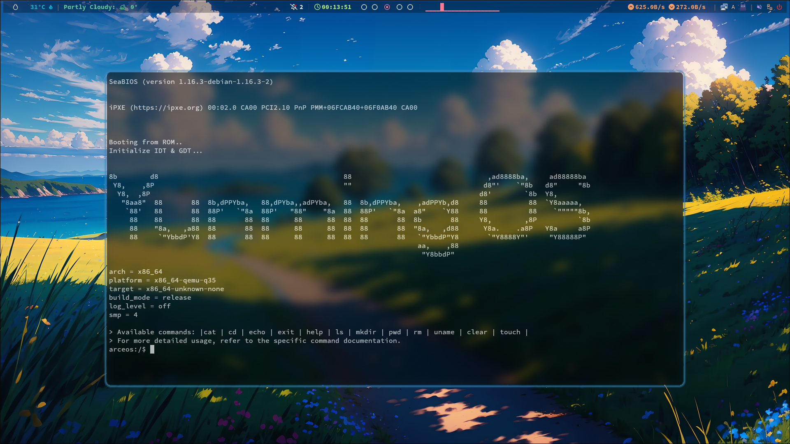

# Yunming OS

## 简介

这是一个基于arceos的unikernel操作系统。这里还提供了最基本的命令行界面，以及基本的文件操作：


目前支持的架构如下:

- [x] x86_64
- [x] ARM架构
- [ ] RISC-V
- [ ] LoongArch

如果你想快速体验，你可以跳转到这个[项目](https://github.com/HugoPhi/unikernel-try)，这里有编译好的内核文件，以及详细的指导教程，让你能够在Docker里面体验这个unikernel操作系统。

## 背景介绍

### Unikernel 基本概念

**操作系统内核架构**

操作系统内核是计算机系统的核心，负责管理硬件资源，包括处理器、内存、磁盘存储等，并为运行在操作系统上的应用程序提供一组接口（系统调用）来访问这些资源。操作系统内核架构是指操作系统内核设计和实现的方式。以下是几种常见的操作系统内核架构：

1. **宏内核（Monolithic Kernel）：** 宏内核将操作系统的所有服务，如设备驱动、文件系统、网络协议栈和进程调度等都集成在一个大的内核中，运行在内核空间。这种设计使得各个模块可以直接相互通信，因此性能较好。然而，宏内核的缺点是任何一个故障都可能导致整个系统崩溃。另外，由于所有模块都紧密耦合在一起，修改或添加功能也比较困难。Linux和UNIX就是采用宏内核设计的例子。
1. **微内核（Microkernel）：** 微内核只保留最基本的、必要的服务在内核空间，如进程间通信、内存管理和基本的I/O操作等，其他高级服务例如设备驱动、文件系统等都运行在用户空间。这样的设计使得系统更加稳定，因为即使一个服务出现故障也不会影响到整个系统，同时也使得系统更易于维护和扩展。但在性能方面，由于需要频繁地进行用户空间与内核空间之间的上下文切换，微内核的性能通常低于宏内核。Minix和QNX是采用微内核设计的例子。
1. **混合内核（Hybrid Kernel）：** 混合内核是试图结合宏内核和微内核的优点的一种设计方式。它尽量将更多的服务放入内核空间执行以提高性能，同时也尽可能地减少模块之间的依赖以增强稳定性。Windows NT和MacOS X的XNU内核都是混合内核的例子。
1. **外核（Exokernel）：** 外核将传统内核的抽象层次降低，允许应用程序直接管理硬件资源，从而提高效率。在外核架构中，内核仅负责确保资源的安全共享，而具体的资源管理策略则交给应用程序自己去确定。
1. **单内核（Unikernel）：** 单内核是一种新兴的内核架构，它将应用程序和内核捆绑在一起形成一个单一的可执行映像，该映像可以直接运行在虚拟机或裸机上。单内核适用于云计算和物联网环境，它的优点是体积小，启动快，但对开发者的编程要求较高。

**单内核（Unikernel）架构**

单内核（Unikernel）架构有如下特点:

1. 单一镜像：将应用程序代码与操作系统核心功能合并到一个单一的可执行镜像中。这个镜像包含了应用程序所需的所有组件，包括网络协议、文件系统和设备驱动等。因此，每个 Unikernel 实例都是一个独立的、自包含的单元。
1. 定制性：根据应用程序的需求进行定制，只包含必要的组件和库。这种定制性减少了不必要的功能和复杂性，在资源受限的环境下更加高效。
1. 轻量级：相比传统操作系统，内存占用更小，启动时间更短。由于只包含必要的组件，它可以更好地适应嵌入式系统、虚拟化环境和云计算平台等资源受限的场景。
1. 性能效率：通过减少不必要的软件层和系统调用，减少了性能开销，使得应用程序可以更高效地运行。

总的来说，Unikernel 是一种精简、定制化的操作系统构建技术，旨在提供更高的性能、更低的资源消耗和更强的安全性。它适用于各种场景，包括嵌入式系统、云计算平台和容器化环境等。

为了更好的理解Unikernel，我们对 Unikernel（单一内核）、 Micro Kernel（微内核）、Monolithic Kernel（宏内核）进行对比。

| | Unikernel（单一内核） | Micro Kernel（微内核） | Monolithic Kernel（宏内核） |
| -------- | ---------------------------------------------------------------------------------------- | ------------------------------------------------------------------------------------------------------------------------ | ---------------------------------------------------------------------------------------------- |
| 架构 | 将应用程序,操作系统内核,必要的组件紧密集成在一起,以创建一个高度定制化和最小化的镜像。 | 采用模块化设计，将操作系统的核心功能最小化，额外的功能和服务实现为用户空间的服务模块。 | 将各种功能和服务集成到一个单体内核中，如进程管理、内存管理、文件系统、网络协议栈等。 |
| 功能分配 | 包含应用程序所需的最小化操作系统功能和库。 | 包含基本的操作系统功能，如进程管理、内存管理和进程间通信，而其他功能如文件系统、网络协议栈等被实现为用户空间的服务模块。 | 包含大量的功能和服务，这些功能和服务直接运行在内核空间，具有较高的集成性和内核级别的访问权限。 |
| 性能 | 镜像小，启动速度快，没有额外的组件和系统调用，具有更高的性能和较低的资源消耗。 | 将功能模块化并移至用户空间，其性能相对较低。模块之间需要进行消息传递和系统调用，会引入额外的开销。 | 内核和服务的紧密集成，有较高的性能 |
| 特权级 | 同一地址空间同一特权级。 | 只有进程管理和进程间通信在内核态 | 所有硬件操作在内核态 |
| 代表系统 | ArceOS,Unikraft,MirageOS,IncludeOS | QNX,MINIX,L4微内核系列 | Linux,Windows |

### ArceOS概述

#### **ArceOS要解决的问题**

1. **性能问题**

传统宏内核架构和微内核架构的操作系统在性能上有一些可以优化的地方，但在具体实施上又很难做到。

- 如果OS信任APP，那么没有必要建立特权级隔离，这样可以减少特权级上下文切换和不同特权级间数据拷贝的性能开销
- 如果支持单应用，那么多个地址空间在单个应用程序域中的用处不大，反而会带来性能开销
- 如果支持功能有限的应用，那么与此无关的的内核功能模块也是没有必要的，这样可以减少内核的体积，减少内核启动时间
- 传统操作系统通用性的设计会引入不必要的开销，如虚拟文件系统的通用表示对于网络应用引入了不必要的过长执行路径
- 对于不同应用的需求可以采用不同的内核功能模块，如不同的内存分配算法/调度算法等，以提高整体性能

2. **安全问题**

ArceOS采用了一系列的新技术来解决传统操作系统的安全问题。

- 采用Rust语言开发内核和应用
- 对于Rust应用，尽量避免采用unsafe code进行编码
- 对于C/C++应用，可以与OS一起整体隔离在一个虚拟机中执行
- 采用单应用的架构，避免了不同应用之间的相互干扰

3. **生态问题**

ArceOS在架构设计上，虽然目前的重点是基于Unikernel架构，但也通过一系列的架构设计，支持宏内核和微内核架构。

- 在现有unikernel架构上进行扩展，支持宏内核或微内核架构
- 通过支持Linux ABI，形成libc，支持Linux应用
- 通过支持Linux Syscall，直接支持Linux应用运行
- 通过支持Rust std库，直接支持Rust应用运行

4. **开发问题**

操作系统开发一直是一个比较困难的事情，实际情况是操作系统（如Linux）随着时间的发展越来越庞大臃肿，难以维护和开发。将来的操作系统可能不是像现在统治世界的 Linux、Windows 那样庞大而通用，而是各种可以迅速组合形成的，并且功能丰富多彩的组件化定制操作系统，能够快速适配未来多种多样的处理器、加速器、外设和应用需求，在开发的便捷性、性能和安全性等方面优于已有的通用操作系统。但如何设计组件化定制操作系统是一个需要深入思考的挑战性问题。为此ArceOS的开发者们一直在思考能否通过基于泛型的独立功能组件来快速构建各种领域专用的OS。

开发操作系统的痛点是开发者编写操作系统软件很繁琐，需要关注的细节太多。其根本原因是操作系统内部模块广泛的相互依赖带来的软件复杂性，以及操作系统的自包含性带来的软件不可重用性。应把操作系统看出是一个多层次的软件栈，分析操作系统中各个功能的层次划分，各个功能模块具有独立性，从而形成面向操作系统的层次化软件开发方法。

#### **ArceOS的设计思想，原则**

操作系统开发者希望能够快速创建一个面向特定领域的操作系统内核，且对于每个应用程序，能确保最佳性能、高安全和高可靠的需求，同时能轻松移植现有的应用程序。为此，需要建立如下一些设计原则：

- 单体执行：应用与内核形成一个整体，运行在裸机或虚拟机上。
- 单地址空间：主要针对单个应用程序方案，不同的应用程序通过共享内存或网络通信交互。
- 单保护域：应用程序与内核运行在同一特权级，应用程序可以直接访问内核的数据结构和硬件资源。
- 与OS无关的内核功能组件：形成广泛的内核功能组件，可在没有OS的情况下独立运行和测试。
- 与硬件无关的内核功能组件：形成广泛的内核功能组件，可在不同的硬件平台上运行。
- 支持Linux ABI：支持Linux应用程序运行。
- 支持Rust std库：支持Rust应用程序运行。
- 架构可扩展：除了单体内核架构，也可扩展为微内核架构和宏内核架构。

简而言之，ArceOS是一个基于Rust语言的Unikernel，它的目标是为云计算平台提供一种高性能、高可靠、高安全、易开发的操作系统解决方案。ArceOS的设计思路是将操作系统的核心功能和应用程序紧密集成在一起，形成一个单一的可执行镜像，这个镜像包含了应用程序所需的所有功能组件，包括网络协议、文件系统和设备驱动等。而组成ArceOS的功能组件是可以独立存在的，并可以与其它功能组件组合，形成新的领域操作系统内核。

## 框架

对于ArceOS的系统的设计的介绍比较多，我将会把这部分放到`doc/`里面。   
另外，也可以参考[原项目](https://github.com/arceos-org/arceos)。

## 改进

## 计划

- [ ] 实现TCP/IP协议栈，不依赖于原先的网络接口
- [ ] 对RISCV版本进行调试，并成功运行
- [ ] 增加对LoongArch64的开发

## 工程量

```sh
-------------------------------------------------------------------------------
Language                     files          blank        comment           code
-------------------------------------------------------------------------------
Rust                           143           1878           2573          10275
TOML                            27            133            311            866
make                            11            129            102            529
Assembly                         6             79             39            481
Markdown                         1             18              0             38
Bourne Shell                     1              6              1             23
Dockerfile                       1              4              0             13
-------------------------------------------------------------------------------
SUM:                           190           2247           3026          12225
-------------------------------------------------------------------------------
```
