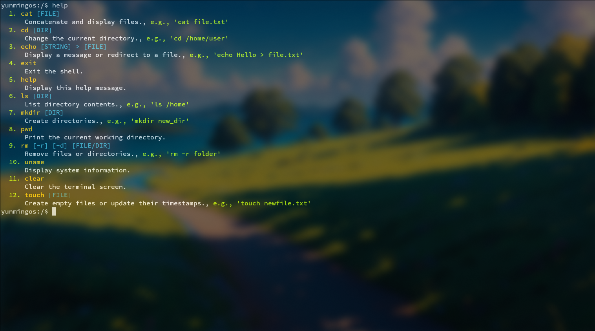

# Yunming OS

## 简介

这是一个基于arceos的unikernel操作系统。这里还提供了最基本的命令行界面，以及基本的文件操作：



目前支持的架构如下:

- [x] x86_64
- [x] ARM架构
- [ ] RISC-V
- [ ] LoongArch

如果你想快速体验，你可以跳转到这个[项目](https://github.com/HugoPhi/unikernel-try)，这里有编译好的内核文件，以及详细的指导教程，让你能够在Docker里面体验这个unikernel操作系统。

## 环境搭建

为了更快搭建环境，我们提供了docker的镜像并且已经发布，纤细在这里介绍：[环境搭建](./doc/env.md)。

## 背景介绍

### Unikernel：像开发应用一样开发操作系统

##### 组件化定制操作系统的历史回顾

组件化定制操作系统的这种想法早在二十世纪九十年代学术界就有过大胆的尝试，如MIT的PDOS课题组提出的[Exokernel](https://pdos.csail.mit.edu/archive/exo/)和剑桥大学等提出的[Nemesis操作系统](https://www.cl.cam.ac.uk/research/srg/netos/projects/archive/nemesis/)是第一轮组件化操作系统的探索，其特点是通过把操作系统的部分功能以专用库的形式提供给应用程序使用，运行在用户态，以提升系统的整体性能。由于开发的成本过高，而使用领域比较窄，没有在产业界落地。

进入二十一世纪后，Internet席卷全球，如何优化云计算和虚拟化成为新热点，学术界开始了第二轮组件化操作系统的发展，典型的例子是犹它（utah）大学计算机科学系FLUX研究组提出的[OSKit项目](https://www.cs.utah.edu/flux/oskit/)，基于C语言设计了34个组件库和一个连接这些组件库的框架来形成不同功能的特定操作系统内核。2007年剑桥大学计算机实验室用领域相关语言（Domain-Specific Language）MPL和类型安全的OCaml函数式语言设计实现了SSH和DNS服务器，也成为了后续基于OCaml语言的组件化[MirageOS](https://mirage.io/)的基础。这一次的探索依然没有被产业界广泛接受。其中很重要的一部分原因其实在编程语言上。C语言没有方便的面向对象的能力，也缺失泛型等语言特征，不具有广泛的重用性，难以形成可被广泛重用的组件。而Ocaml语言的抽象能力很强，安全性也很好，但它具有主流函数式语言的通病，相对于C语言，其通用性很弱，而性能更差，缺少对已有应用的支持，难以得到产业界认可。不过组件化操作系统的探索还在继续，2018年,Rice大学提出了基于Rust语言的Theseus操作系统，通过精心设计的内核组件，支持操作系统的组件在线更新，使得操作系统的可靠性得到很大增强。但由于过于注重高可靠设计，在性能和已有应用的支持比较差。

2014年以后，学术界意识到如果要得到产业界的认可，需要支持在性能和应用支持上突破，这方面的代表是NEC欧洲实验室、Lancaster大学、Manchester大学、University Politehnica of Bucharest等合作设计的Unikraft操作系统。Unikraft操作系统采用C语言编写，由不同的组件库构成，支持云计算环境中的常用Linux应用。由于采用unikernel架构设计，让应用程序和操作系统内核都运行在内核特权态，提高了整体性能。Unikraft的性能和对Linux应用的支持，使得它得到了产业界一定的认可和使用。但Unikraft采用C语言设计实现，这导致了内核组件的重用性和安全性还需提高。

##### 开发新型操作系统的关键问题

而我们觉得设计组件化定制操作系统一个重要因素是重新思考操作系统的编程语言。通过这几年用Rust语言设计操作系统内核的探索，我们觉得采用Rust语言来设计内核组件并形成各种定制的操作系统也许是一条可行的道路。我们的工程师和学生在Rust写操作系统方面进行了探索，设计了rCore、zCore、aCore、rCore Tutorial等各种类型的操作系统原型。在这个过程中，我们发现，虽然操作系统的设计实现细节不同、支持应用程序的Syscall（系统调用）不同、支持的处理器硬件和外设各不相同，但还是有大量共性的操作系统功能存在。这促使我们重新思考如下一些问题：

1. 操作系统能向小型专用的方向发展吗？

我们的分析结果是能，且很有必要。到目前为止，大家经常见到的都是通用的操作系统，如Windows、Linux、MacOS等，或者是基于Linux操作系统的Android系统等。但这样的操作系统对于目前新的应用领域不一定合适，比如在智能汽车的控制领域，需要支持非常轻量实时高可靠的嵌入式应用，在智能汽车的智驾领域，需要的是支持AI加速和及时处理环境大数据的人工智能应用。这几类应用不需要我们常见的可视化图形交互界面等，对操作系统的需求不在于丰富的人机交互，不需要处理办公所需的打印机需求等，而在于安全、可靠地及时响应事件和高效处理数据。操作系统需要的功能需求和要应对的外设相对通用操作系统也少不少。如果对于这类应用采用庞大的Linux操作系统，虽然在功能上能满足需求，但在性能、安全和可靠性等方面的要求，Linux操作系统难以满足。采用小型专用的操作系统相对更容易满足这方面的要求。

2. 现有的RTOS等专用系统能满足以人工智能应用为代表的新应用需求吗？

我们认为是比较困难。现有的RTOS主要面向的是传统的嵌入式应用，所以在设计上很简洁，实时性是其考虑的重点。但现有的人工智能应用的复杂性更高了，大量人工智能应用在Linux上开发和运行，难以直接运行在RTOS上。如果要运行在RTOS上，需要考虑对AI加速外设的支持，以及对Linux应用的支持，这对很多RTOS而言，有比较大的挑战。

3. 主流的通用操作系统和RTOS在安全性上有何需要注意的地方？

我们认为注意的关键因素之一是编程语言。主流的通用操作系统和RTOS大部分都是基于C语言开发，C语言简洁高效、灵活性很大（如指针操作和类型转换等），就是为开发UNIX操作系统而诞生的。但随着软件复杂性的增加，即使是操作系统内核的专业开发人员，也会出现常见的内存相关和并发相关的编程错误。所以，采用安全性高的编程语言（如Go、Swift、C#、Java、Rust等）是一种可行的解决方案，如果把性能也作为重要因素来考虑，那么采用Rust语言开发操作系统是一种合适选择。

4. 开发操作系统的痛点是什么？

我们认为开发操作系统的痛点编写操作系统软件很繁琐，需要关注的细节太多。其根本原因是操作系统内部模块广泛的相互依赖带来的软件复杂性，以及操作系统的自包含性带来的软件不可重用性。

每个应用程序员都知道，自己写的程序一定会依赖下层的各种软件库和编程框架。现在编写一个流行的人工智能应用比较容易，我们经常看到经验不是很丰富的程序员用十几行Python代码就可以实现人脸识别。这并不意味着人工智能的技术不复杂且很容易掌握，而是由于实现深度机器学习算法的专家给上层应用提供了统一的编程框架（如TensorFlow、Pytorch）和简洁编程接口，而实现NVIDIA AI加速硬件驱动的专家给实现深度机器学习算法的专家提供了统一的CUDA编程框架和接口。

Linux的GUI 应用程序员需要了解KDE或Gnome的编程框架和API接口，但不用了解KDE或Gnome的内部实现。实现KDE或Gnome的程序员知道自己写的程序一定依赖底层绘图库Qt或GTK的API接口，以及底层的X Windows或Wayland 库的GUI支持API，但也不用了解这些底层库的具体实现。

每一层的开发者基本上不用考虑下面各层开发者需要考虑的细节，只需根据直接下层开发者提供的编程框架和接口进行开发就好了。这其实就是非常经典的软件工程开发方法：层次化软件程序设计。这种设计方法带来了软件重用和开发方便的好处，推动程序员开发出丰富多彩的应用程序。

另外，对于提供软件编程框架或软件库的软件设计者而言，他有很明确的服务对象 -- 上层软件开发者，而不是他自己。所以，他需要考虑上层应用的需求，把尽可能多的复杂实现细节留给自己，把尽可能简洁和通用的编程接口留给上层软件开发者。如果他不这样做，很难让开发者接受自己提供的软件。

但一个奇怪的现象是：在操作系统的设计实现中，并没有采用层次化软件程序设计这样的开发方法。以Linux为例，虽然Linux为了支持应用，在系统调用层面，采用了得到业界共识的POSIX接口作为系统调用的接口，并保证了接口的长期稳定不变。但在Linux内核的内部实现中，各个功能模块之间的\[相互依赖性（函数调用或数据访问）非常大\](unikraft eurosys21 paper)，如果要对其中一个模块进行重新设计，几乎需要了解与其它各个模块的依赖关系。这使得Linux内核开发是一个非常有挑战的工作。

操作系统中软件的不可重用性，也极大地阻碍了内核程序员像应用程序员一样开发出丰富多彩的各种操作系统。前面已经提到支持上层应用的软件层次形成了一个软件栈，软件栈中的每层软件是直接向下依赖的。每一层的软件都知道自己需要使用的下层软件提供了哪些功能和服务，这样就可以充分利用下层软件来实现自己的功能，从而达到了软件重用的目的。

但操作系统是这个软件栈的最底层，再向下就是CPU和各种外设的计算机硬件了。所以操作系统是一个自包含的软件系统，它需要实现它所需要的各种功能，且实现的功能是很多是为自己服务的。以Linux为例，它除了给上层应用提供POSIX接口的系统调用所需功能外，这些功能所依赖的其它软件也都是操作系统的组成部分，所以，我们在操作系统内部可以看到给应用提供服务的进程管理、内存管理、文件系统管理这些核心模块，还需要调度、任务切换、中断处理、页表处理、异常处理，I/O缓冲区管理、设备驱动程序支持、同步互斥支持等各种内核模块的支持。而且模块间是多对多的依赖关系。这使得如果想把一个Linux的内核模块拿出来重用来实现一个新的操作系统，就不得不解决模块间繁多的依赖关系，让开发新的操作系统变得非常困难。

5. 为何Linux操作系统内部具有强相互依赖性和自包含性？

这可以通过操作系统的发展史来分析。操作系统可以说是生存周期最长的软件，但操作系统的前期规划与设计具有很大的偶然性、历史局限性和开发者的个人主观特征。1991年发布的Linux的软件设计思路来源于1969年的UNIX，而它们在最开始都是由一位天才的软件开发程序员来完成的。但开发Linux的Linus Torvalds和开发UNIX的 Ken Thompson难以预估到2023年的今天操作系统跑在哪些硬件上，支持哪些应用。

先看看UNIX。在1969年~1972年期间，贝尔实验室的两位软件工程师 Ken Thompson 与 Dennis Ritchie经历多次迭代开发，用汇编语言写UNIX，再尝试用B语言写UNIX，最后发明C语言重写UNIX。整个操作系统的核心代码量在一万行以下。对于用三周时间就一个人独立写出UNIX的天才程序员Ken Thompson而言，编写一个一万行的软件游刃有余。对于规模一万行的软件，其内部功能模块的强相互依赖性和自包含性都不会严重阻碍软件开发和软件重用。让他考虑层次化软件设计方法来写UNIX有点像高炮打蚊子。而Dennis Ritchie设计C语言就是为了方便开发UNIX操作系统，所以编程简洁灵活，方便访问硬件，以及良好的可移植性成为C语言的首要设计目标。安全、并发、面向对象、泛型、支持大规模软件等这些现代高级编程语言的设计目标不仅在当时不存在，即使到了2023年的今天，在C语言中也不存在。当AT&T早期的UNIX操作系统源码免费发放给外界程序员后，后续的内核开发者对UNIX的功能进行了广泛的扩展。C语言的灵活性在其中发挥了巨大的作用，C语言非常方便的类型转换和指针，以及简明的结构化编程支持，使得在早期直接添加软件模块实现新功能比较容易。但操作系统的代码量的迅速膨胀，软件规模从一万行扩展到一百万行，再扩展到一千万行，量变形成了质变。强相互依赖性和自包含性就从微不足道的特征从软件工程的角度看，变成阻碍操作系统发展的瓶颈。我们可以看到，开发Linux内核的程序员数量，远少于其它系统软件或应用软件的程序员数量；国际上各种操作系统的数量也远少于某类应用或某类系统软件的数量。目前的现状是，主流操作系统变得越来越庞大，种类也变得越来越少。这其实不利于操作系统自身生态的发展。

### Unikernel 基本概念

**操作系统内核架构**

操作系统内核是计算机系统的核心，负责管理硬件资源，包括处理器、内存、磁盘存储等，并为运行在操作系统上的应用程序提供一组接口（系统调用）来访问这些资源。操作系统内核架构是指操作系统内核设计和实现的方式。以下是几种常见的操作系统内核架构：

1. **宏内核（Monolithic Kernel）：** 宏内核将操作系统的所有服务，如设备驱动、文件系统、网络协议栈和进程调度等都集成在一个大的内核中，运行在内核空间。这种设计使得各个模块可以直接相互通信，因此性能较好。然而，宏内核的缺点是任何一个故障都可能导致整个系统崩溃。另外，由于所有模块都紧密耦合在一起，修改或添加功能也比较困难。Linux和UNIX就是采用宏内核设计的例子。
1. **微内核（Microkernel）：** 微内核只保留最基本的、必要的服务在内核空间，如进程间通信、内存管理和基本的I/O操作等，其他高级服务例如设备驱动、文件系统等都运行在用户空间。这样的设计使得系统更加稳定，因为即使一个服务出现故障也不会影响到整个系统，同时也使得系统更易于维护和扩展。但在性能方面，由于需要频繁地进行用户空间与内核空间之间的上下文切换，微内核的性能通常低于宏内核。Minix和QNX是采用微内核设计的例子。
1. **混合内核（Hybrid Kernel）：** 混合内核是试图结合宏内核和微内核的优点的一种设计方式。它尽量将更多的服务放入内核空间执行以提高性能，同时也尽可能地减少模块之间的依赖以增强稳定性。Windows NT和MacOS X的XNU内核都是混合内核的例子。
1. **外核（Exokernel）：** 外核将传统内核的抽象层次降低，允许应用程序直接管理硬件资源，从而提高效率。在外核架构中，内核仅负责确保资源的安全共享，而具体的资源管理策略则交给应用程序自己去确定。
1. **单内核（Unikernel）：** 单内核是一种新兴的内核架构，它将应用程序和内核捆绑在一起形成一个单一的可执行映像，该映像可以直接运行在虚拟机或裸机上。单内核适用于云计算和物联网环境，它的优点是体积小，启动快，但对开发者的编程要求较高。

**单内核（Unikernel）架构**

单内核（Unikernel）架构有如下特点:

1. 单一镜像：将应用程序代码与操作系统核心功能合并到一个单一的可执行镜像中。这个镜像包含了应用程序所需的所有组件，包括网络协议、文件系统和设备驱动等。因此，每个 Unikernel 实例都是一个独立的、自包含的单元。
1. 定制性：根据应用程序的需求进行定制，只包含必要的组件和库。这种定制性减少了不必要的功能和复杂性，在资源受限的环境下更加高效。
1. 轻量级：相比传统操作系统，内存占用更小，启动时间更短。由于只包含必要的组件，它可以更好地适应嵌入式系统、虚拟化环境和云计算平台等资源受限的场景。
1. 性能效率：通过减少不必要的软件层和系统调用，减少了性能开销，使得应用程序可以更高效地运行。

总的来说，Unikernel 是一种精简、定制化的操作系统构建技术，旨在提供更高的性能、更低的资源消耗和更强的安全性。它适用于各种场景，包括嵌入式系统、云计算平台和容器化环境等。

为了更好的理解Unikernel，我们对 Unikernel（单一内核）、 Micro Kernel（微内核）、Monolithic Kernel（宏内核）进行对比。

| | Unikernel（单一内核） | Micro Kernel（微内核） | Monolithic Kernel（宏内核） |
| -------- | ---------------------------------------------------------------------------------------- | ------------------------------------------------------------------------------------------------------------------------ | ---------------------------------------------------------------------------------------------- |
| 架构 | 将应用程序,操作系统内核,必要的组件紧密集成在一起,以创建一个高度定制化和最小化的镜像。 | 采用模块化设计，将操作系统的核心功能最小化，额外的功能和服务实现为用户空间的服务模块。 | 将各种功能和服务集成到一个单体内核中，如进程管理、内存管理、文件系统、网络协议栈等。 |
| 功能分配 | 包含应用程序所需的最小化操作系统功能和库。 | 包含基本的操作系统功能，如进程管理、内存管理和进程间通信，而其他功能如文件系统、网络协议栈等被实现为用户空间的服务模块。 | 包含大量的功能和服务，这些功能和服务直接运行在内核空间，具有较高的集成性和内核级别的访问权限。 |
| 性能 | 镜像小，启动速度快，没有额外的组件和系统调用，具有更高的性能和较低的资源消耗。 | 将功能模块化并移至用户空间，其性能相对较低。模块之间需要进行消息传递和系统调用，会引入额外的开销。 | 内核和服务的紧密集成，有较高的性能 |
| 特权级 | 同一地址空间同一特权级。 | 只有进程管理和进程间通信在内核态 | 所有硬件操作在内核态 |
| 代表系统 | ArceOS,Unikraft,MirageOS,IncludeOS | QNX,MINIX,L4微内核系列 | Linux,Windows |

### ArceOS概述

#### **ArceOS要解决的问题**

1. **性能问题**

传统宏内核架构和微内核架构的操作系统在性能上有一些可以优化的地方，但在具体实施上又很难做到。

- 如果OS信任APP，那么没有必要建立特权级隔离，这样可以减少特权级上下文切换和不同特权级间数据拷贝的性能开销
- 如果支持单应用，那么多个地址空间在单个应用程序域中的用处不大，反而会带来性能开销
- 如果支持功能有限的应用，那么与此无关的的内核功能模块也是没有必要的，这样可以减少内核的体积，减少内核启动时间
- 传统操作系统通用性的设计会引入不必要的开销，如虚拟文件系统的通用表示对于网络应用引入了不必要的过长执行路径
- 对于不同应用的需求可以采用不同的内核功能模块，如不同的内存分配算法/调度算法等，以提高整体性能

2. **安全问题**

ArceOS采用了一系列的新技术来解决传统操作系统的安全问题。

- 采用Rust语言开发内核和应用
- 对于Rust应用，尽量避免采用unsafe code进行编码
- 对于C/C++应用，可以与OS一起整体隔离在一个虚拟机中执行
- 采用单应用的架构，避免了不同应用之间的相互干扰

3. **生态问题**

ArceOS在架构设计上，虽然目前的重点是基于Unikernel架构，但也通过一系列的架构设计，支持宏内核和微内核架构。

- 在现有unikernel架构上进行扩展，支持宏内核或微内核架构
- 通过支持Linux ABI，形成libc，支持Linux应用
- 通过支持Linux Syscall，直接支持Linux应用运行
- 通过支持Rust std库，直接支持Rust应用运行

4. **开发问题**

操作系统开发一直是一个比较困难的事情，实际情况是操作系统（如Linux）随着时间的发展越来越庞大臃肿，难以维护和开发。将来的操作系统可能不是像现在统治世界的 Linux、Windows 那样庞大而通用，而是各种可以迅速组合形成的，并且功能丰富多彩的组件化定制操作系统，能够快速适配未来多种多样的处理器、加速器、外设和应用需求，在开发的便捷性、性能和安全性等方面优于已有的通用操作系统。但如何设计组件化定制操作系统是一个需要深入思考的挑战性问题。为此ArceOS的开发者们一直在思考能否通过基于泛型的独立功能组件来快速构建各种领域专用的OS。

开发操作系统的痛点是开发者编写操作系统软件很繁琐，需要关注的细节太多。其根本原因是操作系统内部模块广泛的相互依赖带来的软件复杂性，以及操作系统的自包含性带来的软件不可重用性。应把操作系统看出是一个多层次的软件栈，分析操作系统中各个功能的层次划分，各个功能模块具有独立性，从而形成面向操作系统的层次化软件开发方法。

#### **ArceOS的设计思想，原则**

操作系统开发者希望能够快速创建一个面向特定领域的操作系统内核，且对于每个应用程序，能确保最佳性能、高安全和高可靠的需求，同时能轻松移植现有的应用程序。为此，需要建立如下一些设计原则：

- 单体执行：应用与内核形成一个整体，运行在裸机或虚拟机上。
- 单地址空间：主要针对单个应用程序方案，不同的应用程序通过共享内存或网络通信交互。
- 单保护域：应用程序与内核运行在同一特权级，应用程序可以直接访问内核的数据结构和硬件资源。
- 与OS无关的内核功能组件：形成广泛的内核功能组件，可在没有OS的情况下独立运行和测试。
- 与硬件无关的内核功能组件：形成广泛的内核功能组件，可在不同的硬件平台上运行。
- 支持Linux ABI：支持Linux应用程序运行。
- 支持Rust std库：支持Rust应用程序运行。
- 架构可扩展：除了单体内核架构，也可扩展为微内核架构和宏内核架构。

简而言之，ArceOS是一个基于Rust语言的Unikernel，它的目标是为云计算平台提供一种高性能、高可靠、高安全、易开发的操作系统解决方案。ArceOS的设计思路是将操作系统的核心功能和应用程序紧密集成在一起，形成一个单一的可执行镜像，这个镜像包含了应用程序所需的所有功能组件，包括网络协议、文件系统和设备驱动等。而组成ArceOS的功能组件是可以独立存在的，并可以与其它功能组件组合，形成新的领域操作系统内核。

## 框架


对于ArceOS的系统的设计的介绍比较多，我将会把这部分放到`doc/`里面。另外，也可以参考[原项目](https://github.com/arceos-org/arceos)。
这里是`doc/`下面有关文章的链接：

1. [概要设计](./doc/overview.md)
2. [modules](./doc/fs.md)
3. [shell](./doc/shell.md)
4. [LoongArch64](./doc/loongarch64.md)

## 计划

- [ ] 实现TCP/IP协议栈，不依赖于原先的网络接口
- [ ] 对RISCV版本进行调试，并成功运行
- [ ] 增加对LoongArch64的开发

## 工程量

```sh

```

## Reference

- [ArceOS](https://github.com/arceos-org/arceos)
- [像开发应用一样开发操作系统](https://github.com/chyyuu/thoughts/blob/main/tangram-oskits.md)
