# ArceOS 框架


## ArceOS 框架设计

ArceOS的整体架构如下所示：

<center>



</center>

ArceOS 是一个开源的、组件化的Unikernel。以组合组件库的方式构建系统。使用Rust开发。具有以下特点和功能:

- CPU架构: x86_64， riscv64， aarch64， loongarch64
- 运行平台: QEMU pc-q35 (x86_64)， virt (riscv64/aarch64/loongarch64)
- 支持多线程: Multi-thread
- 调度算法: FIFO/RR/CFS scheduler
- 虚拟IO: VirtIO net/blk/gpu drivers
- 网络协议: TCP/UDP net stack using smoltcp
- 同步/互斥: Synchronization/Mutex
- SMP调度: SMP scheduling with single run queue
- 文件系统: File system

**ArceOS 由apps,crates,modules组成**

- apps: 应用程序。它的运行需要依赖于modules组件库。
- modules: ArceOS的组件库。
- crates: 通用的基础库。为modules实现提供支持。
- feature: ArceOS的功能配置项。


## Hypervisor

**Hypervisor**，又称为虚拟机监控器（Virtual Machine Monitor, VMM），是用于创建和管理虚拟机（Virtual Machines, VMs）的软件、固件或硬件。它允许在同一物理硬件上同时运行多个操作系统实例，每个实例称为一个虚拟机。Hypervisor 在虚拟化技术中扮演着关键角色，通过隔离和分配物理资源，确保各虚拟机之间的独立性和安全性。

### **Hypervisor 的组成**


Hypervisor 通常由以下几个核心组件构成：

1. **虚拟机管理器（VM Manager）**
   - 负责创建、启动、暂停、恢复和销毁虚拟机。
   - 管理虚拟机的生命周期，确保其正常运行。

2. **资源调度器（Resource Scheduler）**
   - 分配和管理物理资源（如 CPU、内存、存储和网络）给各个虚拟机。
   - 确保资源的高效利用和公平分配，防止资源争用。

3. **虚拟设备驱动（Virtual Device Drivers）**
   - 提供虚拟化的 I/O 设备接口，如虚拟网络适配器、虚拟存储控制器和虚拟显示器。
   - 通过 VirtIO 等标准，实现高性能的虚拟设备通信。

4. **安全与隔离模块（Security and Isolation Module）**
   - 确保各虚拟机之间的严格隔离，防止数据泄露和恶意攻击。
   - 实现访问控制和权限管理，保障系统安全。

5. **虚拟化支持层（Virtualization Support Layer）**
   - 集成硬件虚拟化技术（如 Intel VT-x、AMD-V）以提升虚拟化性能。
   - 提供低层次的硬件抽象，支持多种 CPU 架构（如 x86_64、aarch64、riscv64、loongarch64）。

### **Hypervisor 的类型**

Hypervisor 根据其运行方式主要分为两种类型：

1. **Type 1 Hypervisor（原生或裸机 Hypervisor）**
   - 直接运行在物理硬件之上，不依赖于底层操作系统。
   - 具有更高的性能和安全性，常用于企业级数据中心和云计算环境。
   - 示例：Xen,KVM,Hyper-V。

2. **Type 2 Hypervisor（托管 Hypervisor）**
   - 运行在宿主操作系统之上，依赖于底层操作系统的资源管理。
   - 适用于桌面虚拟化和开发测试环境。
   - 示例：VMware Workstation,VirtualBox。

### **ArceOS 中的 Hypervisor**

在 ArceOS 框架中，Hypervisor 模块旨在提供高效、灵活的虚拟化支持，使 ArceOS 能够在多种虚拟环境中运行，或作为虚拟机监控程序运行多个 ArceOS 实例。其主要功能包括：

- **虚拟化支持**：集成主流硬件虚拟化技术，支持在不同 CPU 架构上创建和管理虚拟机。
- **资源调度与管理**：高效分配物理资源，确保各虚拟机的性能和稳定性。
- **虚拟 I/O 支持**：通过 VirtIO 驱动，实现虚拟网络、虚拟存储等高性能 I/O 操作。
- **安全隔离**：确保虚拟机之间的严格隔离，保障系统整体安全。

### **Hypervisor 的应用场景**

Hypervisor 技术在多个领域有广泛的应用，具体包括：

1. **数据中心与云计算**
   - 提供弹性计算资源，支持大规模虚拟化部署。
   - 实现资源的动态分配和高效利用，降低运营成本。

2. **开发与测试**
   - 快速创建和销毁虚拟机环境，支持多操作系统的测试与开发。
   - 提高开发效率，简化测试流程。

3. **桌面虚拟化**
   - 在单一物理机上运行多个操作系统实例，满足不同应用需求。
   - 提供隔离的工作环境，提升安全性。

4. **嵌入式系统**
   - 在资源受限的设备上实现高效的虚拟化，支持多功能集成。
   - 提供灵活的系统配置，满足特定应用场景需求。

5. **安全与隔离**
   - 通过虚拟化技术实现关键应用和服务的隔离，增强系统安全性。
   - 防止恶意软件跨虚拟机传播，保护敏感数据。

通过集成 Hypervisor 模块，ArceOS 不仅能够作为独立的操作系统运行，还能在虚拟化环境中高效运作，为云计算、开发测试、嵌入式系统等多种应用场景提供强大的支持。


## 与具体 OS 无关的部分： crates库

Crates为Modules实现提供更底层的支持，是通用的基础库，与os无关。

**Crates 列表**

| Library          | Description                                                                  | Version   |
|------------------|------------------------------------------------------------------------------|-----------|
| allocator        | 内存分配算法，包括：bitmap、buddy、slab。                                    | 0.1.1     |
| arm_gic          | ARM通用中断控制器 (GICv2) 。                                                 | latest    |
| arm_pl011        | ARM串行通信接口，用于处理器和外部设备之间的串行通信 。                       | 0.1.0     |
| axerrno          | ArceOS的错误码定义。                                                         | 0.1.0     |
| axfs_devfs       | ArceOS的设备（Device）文件系统，是axfs_vfs一种实现。                         | 0.1.1     |
| axfs_ramfs       | ArceOS的内存（RAM）文件系统，是axfs_vfs一种实现。                            | 0.1.1     |
| axfs_vfs         | ArceOS的虚拟文件系统接口。                                                   | 0.1.1     |
| axio             | no_std环境下的I/O traits 。                                                  | 0.1.0     |
| capability       | Capability-based security 通过设置访问权限控制对系统资源的访问。             | latest    |
| crate_interface  | 提供一种在 crate 中定义接口（特征）的方法，其目的是解决循环依赖。            | 0.1.3     |
| driver_block     | 通用的块存储（磁盘）驱动程序的接口定义。                                     | latest    |
| driver_common    | ArceOS的通用设备驱动接口定义，包括：disk、serial port、 ethernet card、GPU。 | latest    |
| driver_display   | 通用的图形设备驱动程序接口定义。                                             | latest    |
| driver_net       | 通用的网络设备 (NIC) 驱动程序定义。                                          | latest    |
| driver_pci       | 定义对PCI总线操作。                                                          | latest    |
| driver_virtio    | 实现在driver_common定义的驱动。                                              | latest    |
| flatten_objects  | 为每个存储对象分配一个唯一的ID。                                             | latest    |
| handler_table    | 无锁的事件处理程序表。                                                       | 0.1.1     |
| kernel_guard     | 利用RAII创建具有本地IRQ或禁用抢占的临界区，用于在内核中实现自旋锁。          | 0.1.1     |
| lazy_init        | 延迟初始化。                                                                 | latest    |
| linked_list      | 链表。                                                                       | 0.1.0     |
| loongarch64      | 提供loongarch64 cpu的接入支持。                                              | latest    |
| memory_addr      | 提供理物理和虚拟地址操作的辅助函数。                                         | 0.3.1     |
| page_table       | 页表。                                                                       | latest    |
| page_table_entry | 页表项。                                                                     | 0.5.0     |
| percpu           | per-CPU的数据结构。                                                          | 0.1.6     |
| percpu_macros    | per-CPU的数据结构的宏实现。                                                  | 0.1.6     |
| ratio            | 比率相关计算。                                                               | latest    |
| scheduler        | 统一的调度算法接口，包括：cfs、fifo、round_robin。                           | 0.1.0     |
| slab_allocator   | no_std 环境下的 Slab 分配器（一种内存管理算法）。                            | 0.3.1     |
| spinlock         | no_std 环境下的自旋锁实现。                                                  | latest    |
| timer_list       | 定时器，在计时器到期时触发。                                                 | 0.1.0     |
| tuple_for_each   | 提供遍历tuple字段的宏和方法。                                                | latest    |

## 与具体OS有关的部分：modules

Modules是AcreOS的组件集合。

**Modules 列表:**
| 模块       | 描述                                                                 |
|------------|----------------------------------------------------------------------|
| axalloc    | ArceOS 的全局内存分配器。                                           |
| axconfig   | ArceOS 特定平台编译的常量和参数配置。                               |
| axdisplay  | ArceOS 的图形化模块。                                               |
| axdriver   | ArceOS 的设备驱动模块。                                             |
| axfs       | ArceOS 的文件系统模块。                                             |
| axhal      | ArceOS 硬件抽象层，为特定平台的操作提供统一的 API。                 |
| axlog      | ArceOS 多个级别日志记录宏，包括：error、warn、info、debug、trace。  |
| axnet      | ArceOS 的网络模块，包括：IpAddr、TcpSocket、UdpSocket、DnsSocket 等。|
| axruntime  | ArceOS 的运行时库，是应用程序运行的基础环境。                       |
| axsync     | ArceOS 提供的同步操作模块，包括：Mutex、spin。                       |
| axtask     | ArceOS 的任务调度管理模块，包括：任务创建、调度、休眠、销毁等。     |
 
### feature 机制

在ArceOS操作系统中，feature机制是一种允许开发者根据应用程序的需求选择和定制操作系统功能组件的方法。这种机制通过`Cargo.toml`文件中的feature选项来实现，使得开发者可以灵活地开启或关闭特定的功能，从而构建出满足特定应用场景的操作系统内核。

#### 1. 必须模块
ArceOS中的一些模块是所有应用程序都必须的，它们包括：
- **axruntime**：负责从裸机环境启动并进行初始化。
- **axhal**：提供硬件抽象层，为跨平台提供统一的API。
- **axconfig**：包含平台常量和内核参数，例如物理内存基地址、内核加载地址、栈大小等。
- **axlog**：提供多级格式化日志记录功能。

#### 2. 可选模块（Feature）
其他模块则是可选的，它们依赖于应用程序通过feature启用的功能，包括：
- **axalloc**：ArceOS全局内存分配器，依赖于`alloc` feature。
- **axdisplay**：ArceOS图形模块，依赖于`display` feature。
- **axfs**：ArceOS文件系统模块，依赖于`fs` feature。
- **axnet**：ArceOS网络模块，依赖于`net` feature。
- **axdriver**：ArceOS设备驱动，依赖于`driver-*`, `fs`, `net`, `display` feature。
- **axtask**：ArceOS任务管理模块，依赖于`multitask` feature。
- **axsync**：ArceOS同步原语，依赖于`multitask` feature。

#### Feature机制的工作原理
Feature机制的工作原理是通过在`Cargo.toml`文件中定义不同的feature，然后在构建时选择性地编译和链接这些feature。这样，开发者可以根据需要启用或禁用特定的功能，从而实现操作系统的定制化。

#### 3. 使用场景
例如，如果一个应用程序需要图形界面，开发者可以在`Cargo.toml`中启用`display` feature，这样就会包含`axdisplay`模块。如果需要网络功能，可以启用`net` feature，从而包含`axnet`模块。这种机制使得ArceOS能够灵活地适应不同的应用需求，同时保持内核的轻量级和高效性。

通过feature机制，ArceOS实现了高度的模块化和可定制性，这对于开发特定领域的操作系统内核尤为重要。

## 应用层（App）

本项目中的App层实现了一个简单的Shell，用于更直观的用户交互和展示OS的功能。同时也能更好体现Unikernel架构的优势：高内聚，低耦合。

## 设计实现协作式多任务unikernel

在操作系统设计中，如何确保同时处理多个请求？我们可以使用线程或进程进行多任务处理实现，但还有一个选择——协作性多任务处理。

这个选项是最困难的。在这里我们说操作系统当然很酷，它有调度程序和计划程序，它可以处理进程，线程，组织它们之间的切换，处理锁等，但它仍然不知道应用程序是如何工作的，而这些工作原理应该是我们作为开发人员所知道的。

我们知道在CPU上会有短暂的时刻执行某些计算操作，但大多数时候我们都期望网​​络I/O能更清楚何时在处理多个请求之间切换。

从操作系统的角度来看，协作式多任务只是一个执行线程，在其中，应用程序在处理多个请求/命令之间切换。通常情况是：只要一些数据到达，就会读取它们，解析请求，将数据发送到数据库，这是一个阻塞操作；而非堵塞操作时在等待来自数据库的响应时，可以开始处理另一个请求，它被称为“合作或协作”，因为所有任务/命令必须通过合作以使整个调度方案起作用。它们彼此交错，但是有一个控制线程，称为协作调度程序，其角色只是启动进程并让这些线程自动将控制权返回给它。

这比线程的多任务处理更简单，因为程序员总是知道当一个任务执行时，另一个任务不会执行，虽然在单处理器系统中，线程应用程序也将以交错模式执行这种模型，但使用线程的程序员仍应考虑此方法的缺陷，以免应用程序在移动到多处理器系统时工作不正常。但是，即使在多处理器系统上，单线程异步系统也总是以交错方式执行。

编写这样的程序的困难在于，这种切换，维护上下文的过程，将每个任务组织为一系列间歇性执行的较小步骤，落在开发人员身上。另一方面，我们获得了效率，因为没有不必要的切换，例如，在线程和进程之间切换时切换处理器上下文没有问题。

在实现了Hello World编写和运行之后，我们终于可以首窥操作系统内核设计中的第一个重要部分：协作式多任务的实现。

## 协作式多任务的功能需求

### 协作式多任务的主体实现
协作式多任务是一种任务调度方式，它与抢占式多任务(preemptive)相对应，关于后者，我们将在下一章详细说明。在本章学习中，我们先要了解“non-preeptive"——或者说是协作的调度方式。比起抢占，它显得更加友善而不具有侵略性。要设计一个协作式多任务的unikernel，需要满足这些要求：

1. 任务切换机制：实现任务的切换和调度，确保多个任务在适当的时候轮流执行。任务切换应该是协作式的，即任务自愿放弃执行权，而不是由系统强制进行切换。这部分的需求确定了unikernel需要依赖于```axtask```这一module以及```multitask```、`sched_fifo`、`sched_cfs`等任务管理相关的crates。

2. 上下文保存与恢复：在任务切换时，需要保存当前任务的上下文（包括寄存器、程序计数器、堆栈等状态），以便后续能够正确地恢复该任务的执行状态。这也包括了允许任务在运行过程中主动挂起自己，将执行权让给其他任务。同时，需要提供相应的机制来恢复挂起的任务继续执行。

3. 任务优先级管理：支持为不同的任务设置优先级，以确保高优先级的任务在系统资源有限时能够优先得到执行。在ArceOS支持的app中，```apps_priority```实现了这个目标。

4. 任务同步与通信：提供机制来实现任务之间的同步和通信，以防止竞态条件和数据访问冲突。在ArceOS中，我们可以参考app `parallel`了解具体的实现。

5. 定时器和延时：提供定时器功能，允许任务在一定时间后唤醒或执行延时操作。在ArceOS中，我们可以参考app `sleep`了解具体的实现。

可以感受到，比起Hello World，实现协作式多任务涉及到的modules和crates、调用了它们实现的app都大为增加。

### 调试和运行需求
在Hello World的实现过程中，我们已经初步了解了ArceOS从代码再到硬件的落地，最后在嵌入式设备实机运行的过程。在本章，读者可以利用上一章的经验，在硬件设备对生成的二进制镜像进行调试。为此，在最终烧录时ArceOS也将实现开发者的调试和改造需求：

1. 异常处理：处理任务执行过程中可能出现的异常情况，例如任务错误、内存越界等情况。这些比较难处理的错误需要日志的打印来实现，具体操作我们沿用了HelloWorld中的处理，同时引入了app `exception`细化异常打印日志。

2. 系统可扩展性：设计具有良好可扩展性的任务管理机制，允许动态地创建和销毁任务，以适应不同应用场景和任务数量的需求。在实现这个unikernel的app中（`parallel`、`priority`、`sleep`、`yield`），我们都进行了编译内核数、架构、日志输出粒度等的自由设置。

这些功能需求可以根据不同的应用场景和系统设计来进行调整和扩展。实现协作式多任务的关键在于任务的合作和互相信任，确保任务在适当的时机让出执行权，以实现良好的系统响应性和资源利用率。

## 协作式多任务相关的crates/modules组成
### 什么是Crates和Modules
对于初学Rust的读者来说，在继续探索协作式多任务的具体实现前，最好先理解在Rust模块化编程中常见、并在ArceOS中广泛使用的crates和modules的定义。

#### Crate：箱
Crate 是“箱子”的意思。在 《Rust 权威指南》中被翻译为“单元包”。因为Crate 是 Rust 的最小编译单元。
- Crate 在一个范围内将相关的功能组合在一起，并最终通过编译生成一个二进制文件或库。
- Crate 并不等同于一个 .rs 文件。Crate 可以就是一个 .rs 文件， .rs 文件还可以通过 mod 关键字引入其他 .rs 文件中的模块。

所以 Crate 更严格的定义是一个**用于生成库或可执行文件的树形模块结构**。在上一章里最终实现的.bin文件即是依赖crate实现的。

#### Module：模块
Rust 中，模块和单独的文件不存在必然关联。
在编写 Rust 程序时，可以不使用模块。但是当一个 crate 中的代码越来越多时就会变得不好维护，所以就可以将其拆分成一个个独立的模块，以便于增强于可读性和代码复用。
定义模块使用 mod 关键字。也就是说，一个文件中可以没有模块，也可以有多个模块。文件和模块不是一对一的关系。
Rust 中的模块是一种
同时，Module 还能控制代码的可见性，也就是将代码分为公开代码和私有代码，公开代码可以在项目外被使用，私有代码只能在项目内被访问。

### 协作式多任务unikernel依赖modules

#### 从优先级的实现看modules
想要确定一个任务什么时候需要终止运行或是与其它任务共享有限的资源，我们必须首先明确各个任务之间的优先级区别，而优先级一般是由各个任务的到达时间、运行时间等参数确定的。上面这段话涉及到两个关键点——任务本身和ArceOS选择的策略，分别对应到两个module：`axtask`以及`axalloc`；前者负责任务本身（如运行时长等）调配，后者负责操作系统的内存分配策略（cfs、fifo、rr等）的分配。

对于这些分配的算法目前都已经有了成型的实现方法，换句话说它们其实是与操作系统无关的。对于ArceOS，我们可以借助这个特点将它们封装成与系统无关的modules。

对于不同的任务，我们在priority中的`main.rs`进行了手动规定，读者也可以通过修改其中参数运行来观察优先级在不同策略下的分配：
```rust
const TASK_PARAMS: &[TaskParam] = &[
    // four short tasks
    TaskParam {
        data_len: 40,
        value: 1000000,
        nice: 19,
    },
    TaskParam {
        data_len: 40,
        value: 1000000,
        nice: 10,
    },
    TaskParam {
        data_len: 40,
        value: 1000000,
        nice: 0,
    },
    TaskParam {
        data_len: 40,
        value: 1000000,
        nice: -10,
    },
    // one long task
    TaskParam {
        data_len: 4,
        value: 10000000,
        nice: 0,
    },
];
```
在上面的代码里我们规定了四个短任务和一个长任务，长度在参数`value`中确定任务的长度。
```bash
test_one "SMP=1 LOG=info" "expect_info_smp1_fifo.out"
test_one "SMP=1 LOG=info APP_FEATURES=sched_cfs" "expect_info_smp1_cfs.out"
test_one "SMP=1 LOG=info APP_FEATURES=sched_rr" "expect_info_smp1_rr.out"
test_one "SMP=4 LOG=info APP_FEATURES=sched_cfs" "expect_info_smp4_cfs.out"
```
通过上面的任务，相信读者对`axtask`以及`axalloc`的功能已经有了初步的认识,接下来我们可以通过arceos提供的`yield`app来阐明与实现协作式多任务相关的crates。

#### yield：产生多线程的测试

在上面的app中，我们实现了任务的调度，下一个目标即是实现任务间的切换。在任务切换中，线程间的切换相较于线程容易不少，所以我们先从`yield`这一app开始，初步了解实现协作式多任务最终目标前modules和crates是如何衔接的。

现代的任务调度算法基本都是抢占式的，它要求每个应用只能连续执行一段时间，然后内核就会将它强制性切换出去。 一般将 时间片 (Time Slice) 作为应用连续执行时长的度量单位，每个时间片可能在毫秒量级。 一般使用时间片轮转算法 (RR, Round-Robin) 来对应用进行调度。为了实现协作的目标，在运行和测试这个app过程中需要选择传统的cfs或fifo进行测试。

```rust
fn main() {
    for i in 0..NUM_TASKS {
        task::spawn(move || {
            println!("Hello, task {}! id = {:?}", i, task::current().id());
            // 此时已经启动了yield
            // preempt所需要的依赖libax/sched_rr并没有被包含进去,所以这里默认为协作式实现
            #[cfg(not(feature = "preempt"))]
            task::yield_now();

            let order = FINISHED_TASKS.fetch_add(1, Ordering::Relaxed);
            if option_env!("SMP") == Some("1") {
                assert!(order == i); // FIFO scheduler
            }
        });
    }
    println!("Hello, main task{}!");
    while FINISHED_TASKS.load(Ordering::Relaxed) < NUM_TASKS {
        #[cfg(not(feature = "preempt"))]
        task::yield_now();
    }
    println!("Task yielding tests run OK!");
}
```
这是一个利用fifo算法进行线程管理的示例程序。从代码实现细节来看，主要分成两步实现：

1. 操作系统初始化，加载yield app。
2. 使用`task::spawn`循环来生成`NUM_TASKS`任务（类似于线程）。
每个任务执行一个函数，只需打印其ID即可。
如果禁用抢占，也就是应用协作式方法，任务会自动执行`yield`以放弃CPU。如果不使能SMP，使用单核编译，任务的执行顺序必须是`FIFO`。
`main task`将等待所有其他任务完成。如果没有，则继续执行`yield`并等待。

也就是说我们如果不规定APP_FEATURE内参数为抢占，那么将默认采取协作式进行实现。读者可以通过运行以下命令进行测试：
```bash
make A=apps/task/yield ARCH=riscv64 LOG=info NET=y SMP=1 run
```

启动yield的同时，我们实现了更加细节部分的调用，流程图如下：

可以看到，我们在实现协作式多任务相关的unikernel时，需要在统一的接口实现内存分配的算法，包括了`alloc`和`paging`。实现具体分配算法时，则需要调用多任务相关的`multitask`和`schedule`两个crates。

